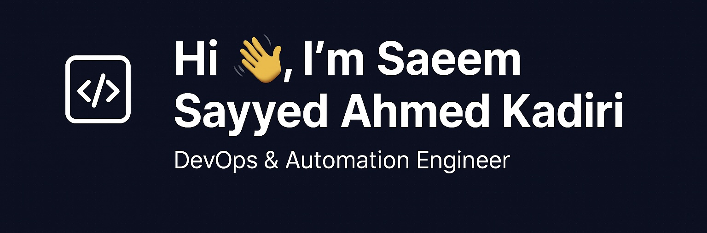

---

## 🛠 Skills & Tools  

---

## 📚 Currently Learning  
- **DevOps Diploma** – DevOps Institute, Mumbai  
- **Terraform** – Infrastructure as Code  
- **Kubernetes** – Container Orchestration  
- **CI/CD Pipelines** – Advanced Jenkins & GitHub Actions  

---

## 🚀 Projects  
- **Telemetry Script**  
  Monitors application performance and reports key metrics.  
  [View Code]()

- **Log Monitoring Script**  
  Analyzes logs and raises alerts for anomalies.  
  [View Code](#)

- **TPS Script**  
  Tracks transactions per second and overall system throughput.  
  [View Code](#)

---

## 📫 Connect With Me  
- **Email:** [saeemkadir@gmail.com](mailto:saeemkadir@gmail.com)  
- **GitHub:** [github.com/your-username](https://github.com/your-username)  
- **LinkedIn:** [linkedin.com/in/your-link](https://linkedin.com/in/your-link)  

---

